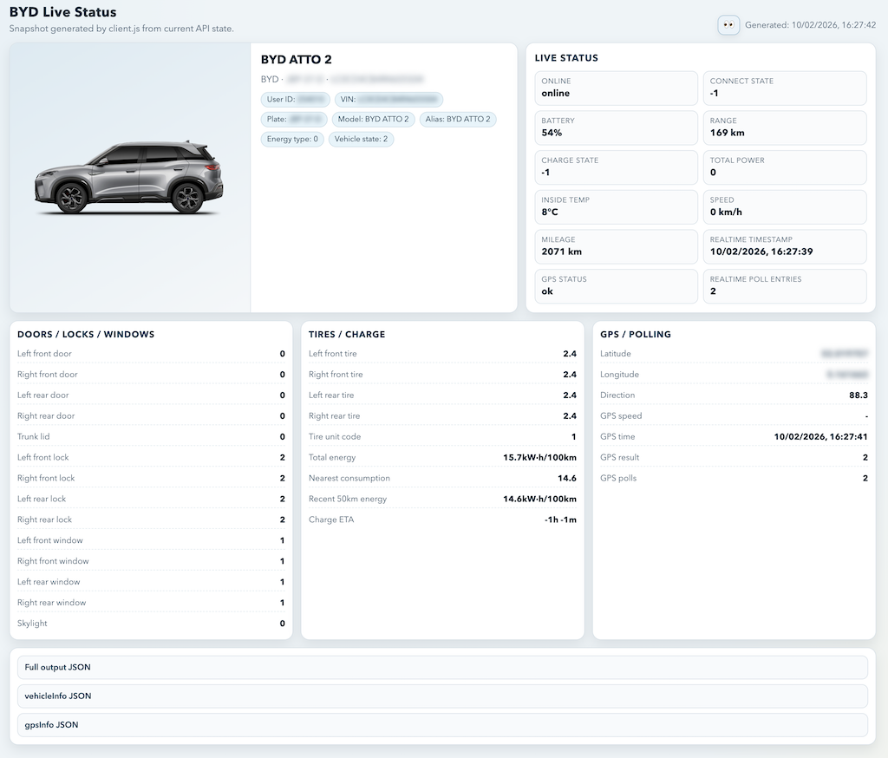

# BYD Reverse Engineering

Reverse engineering of the BYD app HTTP crypto path used in the Android app.

Base host: `https://dilinkappoversea-eu.byd.auto`

## Related Projects

- [`pyBYD`](https://github.com/jkaberg/pyBYD): full Python library built from these reverse-engineering findings.
- [`hass-byd-vehicle`](https://github.com/jkaberg/hass-byd-vehicle): Home Assistant integration for BYD vehicles.
- [`BYD-re custom_components`](https://github.com/codyc1515/BYD-re/tree/main/custom_components/byd): Home Assistant custom component for BYD.

## Quickstart

`client.js` is the main entrypoint. Prerequisite: Node.js 20+.

> **Warning:** Do not commit real credentials, raw personal logs, or decrypted personal data. The `.env` file and `xposed/samples/raw_hooks.log` can contain plaintext identifiers and passwords.

Create `.env`:

```dotenv
BYD_USERNAME=you@example.com
BYD_PASSWORD=your-password
```

Run:

```bash
node client.js
```

The client performs login, fetches your vehicle list, polls real-time vehicle status, retrieves GPS info, and prints ready-to-use `mosquitto_sub` commands for MQTT. It also writes a self-contained dashboard to `status.html`.



The client accepts many `BYD_*` environment variable overrides (`BYD_COUNTRY_CODE`, `BYD_LANGUAGE`, `BYD_VIN`, etc.) — see the top of `client.js` for the full list and defaults.

## Project Map

- `client.js`: minimal login + vehicle list + realtime poll + GPS client + MQTT connection info.
- `mqtt_decode.js`: streaming MQTT payload decoder (AES-128-CBC, hex input → JSON output).
- `decompile.js`: decoder/encoder CLI (debugging/analysis).
- `bangcle.js`: Bangcle envelope encode/decode implementation.
- `bangcle_auth_tables.js`: embedded Bangcle auth tables.
- `URLs.md`: discovered API URL inventory (observed in logs + static `class.dex` candidates).
- `scripts/generate_bangcle_auth_tables.js`: table generator.
- `xposed/http.sh`: decode helper for `HTTP method=` log lines.
- `xposed/src/*`: Xposed hook module source (Java hooks, resources, manifest).

## App & Transport Snapshot

- App: BYD overseas Android app (`com.byd.bydautolink`).
- Hooking compatibility: `2.9.1` is the latest APK version that can be reliably hooked in this setup. Newer versions add Magisk/Zygote/LSPosed/root detection.
- Hookable APK (`2.9.1`): [APKPure download](https://apkpure.com/byd/com.byd.bydautolink/download/2.9.1)
- Client stack: Android + OkHttp (`user-agent: okhttp/4.12.0`).
- API pattern: JSON-over-HTTP POST with encrypted payload wrapper.

Common request characteristics observed in hooks and mirrored by `client.js`:
- `content-type: application/json; charset=UTF-8`
- `accept-encoding: identity`
- `user-agent: okhttp/4.12.0`
- cookie-backed session reuse across calls (client stores and replays returned cookies)

## Crypto Pipeline

Every BYD API call uses multiple crypto layers, described from outermost to innermost.

### 1. HTTP wrapper

Request body: `{"request":"<envelope>"}`. Response body: `{"response":"<envelope>"}`.

### 2. Bangcle envelope (`bangcle.js`)

- Format: `F` + Base64 ciphertext.
- Table-driven Bangcle white-box AES using embedded auth tables from `bangcle_auth_tables.js`.
- CBC mode, zero IV, PKCS#7 padding.
- Decoding strips the `F` prefix, Base64-decodes, decrypts, and removes PKCS#7.

After decoding, the outer JSON payload typically looks like:

```json
{
  "countryCode": "NL",
  "identifier": "<username-or-userId>",
  "imeiMD5": "<md5-hex>",
  "language": "en",
  "reqTimestamp": "<millis>",
  "sign": "<sha1Mixed>",
  "encryData": "<AES-CBC hex>",
  "checkcode": "<md5-reordered>"
}
```

Response-side decoded outer payload:

```json
{
  "code": "0",
  "message": "SUCCESS",
  "identifier": "<userId-or-countryCode>",
  "respondData": "<AES-CBC hex>"
}
```

For a full field-level description and mapping reference, see [`pyBYD/API_MAPPING.md`](https://github.com/jkaberg/pyBYD/blob/main/API_MAPPING.md).

### 3. Inner business payload (`encryData` / `respondData`)

- Fields are uppercase hex AES-128-CBC (zero IV).
- Config endpoints (e.g. `/app/config/getAllBrandCommonConfig`) use static `CONFIG_KEY`.
- `/app/account/getAccountState` uses `MD5(identifier)`.
- Login (`pwdLogin`) uses `MD5(MD5(signKey))` where `signKey` is the plaintext password sent in the outer payload.
- Remote control command password (`commandPwd`) uses uppercase `MD5(<operation PIN>)` (e.g. `123456` → `E10ADC3949BA59ABBE56E057F20F883E`), used by `/vehicle/vehicleswitch/verifyControlPassword` and `/control/remoteControl`.
- Post-login payloads use token-derived keys from `respondData.token`:
  - content key: `MD5(encryToken)` (for `encryData` / `respondData`)
  - sign key: `MD5(signToken)` (for `sign`)

### 4. Signature and checkcode

- Login sign key input is raw password; sign uses `sha1Mixed(buildSignString(..., md5(password)))`.
- Post-login sign uses token-derived sign key.
- `checkcode` is computed from `MD5(JSON.stringify(outerPayload))` with reordered chunks:
  `[24:32] + [8:16] + [16:24] + [0:8]`

## MQTT Real-Time Vehicle Telemetry

BYD uses an [EMQ](https://www.emqx.io/)-based MQTT broker to push real-time vehicle data (telemetry, status updates) to connected clients. The connection uses MQTT v5 over TLS (`mqtts://`, port 8883).

### Connection Parameters

| Parameter | Value | Source |
|-----------|-------|--------|
| **Protocol** | MQTTv5 over TLS | `mqtts://` (port 8883) |
| **Broker** | Dynamic, per-region | API: `/app/emqAuth/getEmqBrokerIp` |
| **Client ID** | `oversea_<IMEI_MD5>` | `IMEI_MD5` uppercased, prefixed with `oversea_` |
| **Username** | `<userId>` | From login response `token.userId` |
| **Password** | `<tsSeconds><MD5(signToken + clientId + userId + tsSeconds)>` | Computed at connect time |
| **Topic** | `/oversea/res/<userId>` | Subscribe to receive vehicle push messages |

The broker hostname is fetched after login via `POST /app/emqAuth/getEmqBrokerIp`. The decrypted response contains the broker address in the `emqBroker` (or `emqBorker`) field.

MQTT credentials are derived from the login session tokens:

1. **Client ID**: `oversea_` + uppercase `MD5(IMEI)`. The default IMEI MD5 is `00000000000000000000000000000000`.
2. **Username**: The `userId` string returned in the login response token.
3. **Password**: Built as `<tsSeconds><hash>` where:
   - `tsSeconds` = current Unix timestamp in seconds
   - `hash` = `MD5(signToken + clientId + userId + tsSeconds)` (lowercase hex)

All MQTT message payloads are **hex-encoded AES-128-CBC** ciphertext with a **zero IV** (same scheme as `encryData`/`respondData`). The decryption key is `MD5(encryToken)` — the same content key used for HTTP response decryption.

### Subscribing with mosquitto

`client.js` prints ready-to-use `mosquitto_sub` commands after login. Example:

```bash
mosquitto_sub -V mqttv5 \
  -L 'mqtts://<userId>:<password>@<broker>/oversea/res/<userId>' \
  -i 'oversea_<IMEI_MD5>' \
  -F '%p' \
  | node ./mqtt_decode.js '<MD5(encryToken)>'
```

`mqtt_decode.js` reads hex-encoded MQTT payloads from stdin and decrypts them with `MD5(encryToken)` as AES key.

## Debugging / Offline Decode (`decompile.js`)

Decode one payload:

```bash
node decompile.js http-dec '<payload>'
```

Accepted input:
- raw Bangcle envelope ciphertext (`F` + Base64/Base64URL payload)
- full JSON body such as `{"request":"..."}` or `{"response":"..."}`
- raw inner hex ciphertext

Common options:

```bash
node decompile.js http-dec '<payload>' --debug
node decompile.js http-dec '<payload>' --state-file /tmp/byd_state.json
```

Encrypt inner JSON with `md5(identifier)` key:

```bash
node decompile.js http-enc '{"k":"v"}' --identifier <id>
```

Decode full hook flow:

```bash
./xposed/http.sh xposed/samples/raw_hooks.log
```

`xposed/http.sh` creates a temporary per-run decode-state file so keys learned from login are reused for later calls in the same flow.

## Internals

### Decoder Key Strategy

`http-dec` inner-field decryption order:
1. static AES keys (`CONFIG_KEY`)
2. learned state keys
3. `md5(identifier)` when identifier is known from parsed outer payload

State behavior:
- default file: `/tmp/byd_http_dec_state.json`
- override: `BYD_DECODE_STATE_FILE` or `--state-file`
- auto-learns `pwdLoginKey = MD5(MD5(signKey))` from login outer payload when present
- auto-learns `contentKey = MD5(token.encryToken)` from decoded login `respondData`

### Bangcle Tables

Runtime uses embedded tables only — `bangcle.js` does not read `.so` files at runtime.

`bangcle_auth_tables.js` is generated from `byd/libencrypt.so.mem.so`:

```bash
node scripts/generate_bangcle_auth_tables.js
```
